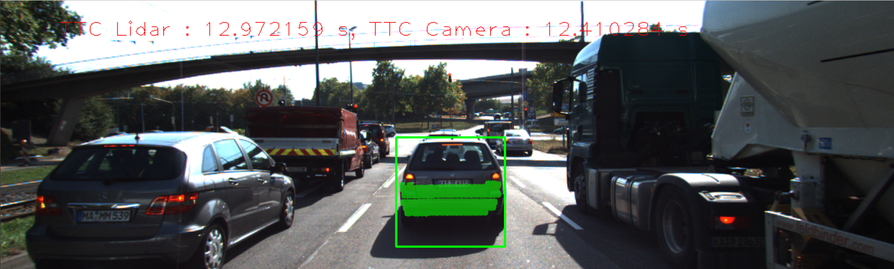

# Track an Object in 3D Space

This fail contains all information regarding the project. The goal of this project is to create a Time To Collision (TTC) estimation system for a preceding vehicle right in front of the ego vehicle, using camera and LiDAR data.

## Match 3D Objects

For matching 3D objects we use the 2D matching based on different detection-descriptor combinations. The steps followed for this task are the following:

1. Match keypoints to a bounding box on each prevFrame and currFrame. For this we iterated over all keypoints and boxes and check if the bounding box encloses the keypoints.
2. Count matches per bounding box. We iterated over the whole matches using the bounding boxes information in step 1. For this we created a map where the key is the pair of (prev_BoxID, curr_BoxID) and the value is the number of keypoints between these two boxes. We did the same with all bounding boxes.
3. We rank and left only the bounding boxes that have the most keypoint matches of all.

## Compute Lidar-based TTC

In this section we had to use the lidar points found between frames in our region of interest (ROI) which is the preceding vehicle rear section. The difficult part on this task was that some cloud points on the preceding vehicle have outliers, making it difficult to measure the closest point to the ego car. 

Thus, we remove outliers that are below a lower_bound following the interquartile range `IQR` concept from statistics. [Reference](https://en.wikipedia.org/wiki/Interquartile_range). In a nutshell the idea is to get the quartiles and considered as outliers any value outside [Q1-1.5\*IQR, Q3-1.5\*IQR], as shown below

[fig reference](https://help.ezbiocloud.net/wp-content/uploads/2020/04/%E1%84%89%E1%85%B3%E1%84%8F%E1%85%B3%E1%84%85%E1%85%B5%E1%86%AB%E1%84%89%E1%85%A3%E1%86%BA-2020-04-19-%E1%84%8B%E1%85%A9%E1%84%8C%E1%85%A5%E1%86%AB-9.41.35.png)

* Once the outliers were removed we now proceed to get the min x value from the points in the bounding box of the preceding vehicle.
* We use the frame rate to calculate the detta time `dt = 1.0/frameRate`
* Finally we use the following equations assuming a constant velocity model. 

where `d1 = distance current frame` and `d0 = distance previous frame.`

## Associate Keypoint Correspondences with Bounding Boxes

In this part we associate bounding boxes with keypoints from detectors which enclose them. To achieve this we iterate only through keypoint matches, but we added an additional step to consider only matches that the distances between previous and current frames are consistent. To discriminate the ones that don't, we used the same `IQR` from statistics we used in the LiDAR TTC estimation. This way, we cleaned a little bit some outlier keypoint matches that could hinder the camera TTC.

## Compute Camera-based TTC

The idea in for the camera based was to used the scale change in each frame to estimate the distance to the preceding vehicle. The way we estimated the scale change was through the relatives keypoints distance changes between frames, as shown below:

Using this concept and again assuming a constant velocity kinematic model we used the following equation to estimate the TTC:

where:

* `d1/d0 = distance ration between matches`. This is a vector.
* `med(d1/d0) = median of all relative distance ratios`

