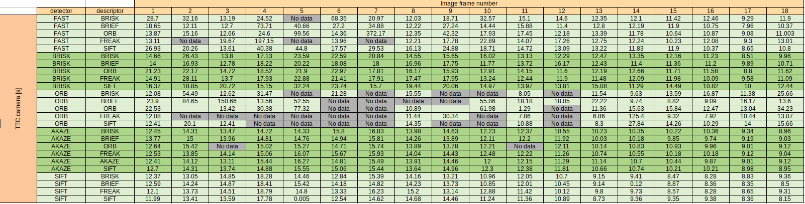
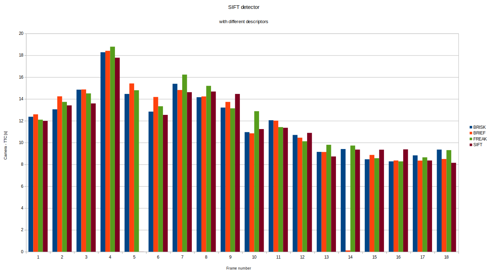

# Track an Object in 3D Space

This fail contains all information regarding the project. The goal of this project is to create a Time To Collision (TTC) estimation system for a preceding vehicle right in front of the ego vehicle, using camera and LiDAR data.

## Match 3D Objects

For matching 3D objects we use the 2D matching based on different detection-descriptor combinations. The steps followed for this task are the following:

1. Match keypoints to a bounding box on each prevFrame and currFrame. For this we iterated over all keypoints and boxes and check if the bounding box encloses the keypoints.
2. Count matches per bounding box. We iterated over the whole matches using the bounding boxes information in step 1. For this we created a map where the key is the pair of (prev_BoxID, curr_BoxID) and the value is the number of keypoints between these two boxes. We did the same with all bounding boxes.
3. We rank and left only the bounding boxes that have the most keypoint matches of all.

## Compute Lidar-based TTC

In this section we had to use the lidar points found between frames in our region of interest (ROI) which is the preceding vehicle rear section. The difficult part on this task was that some cloud points on the preceding vehicle have outliers, making it difficult to measure the closest point to the ego car. 

Thus, we remove outliers that are below a lower_bound following the interquartile range `IQR` concept from statistics. [Reference](https://en.wikipedia.org/wiki/Interquartile_range). In a nutshell the idea is to get the quartiles and considered as outliers any value outside [Q1-1.5\*IQR, Q3-1.5\*IQR], as shown below

[fig reference](https://help.ezbiocloud.net/wp-content/uploads/2020/04/%E1%84%89%E1%85%B3%E1%84%8F%E1%85%B3%E1%84%85%E1%85%B5%E1%86%AB%E1%84%89%E1%85%A3%E1%86%BA-2020-04-19-%E1%84%8B%E1%85%A9%E1%84%8C%E1%85%A5%E1%86%AB-9.41.35.png)

* Once the outliers were removed we now proceed to get the min x value from the points in the bounding box of the preceding vehicle.
* We use the frame rate to calculate the detta time `dt = 1.0/frameRate`
* Finally we use the following equations assuming a constant velocity model. 

where `d1 = distance current frame` and `d0 = distance previous frame.`

## Associate Keypoint Correspondences with Bounding Boxes

In this part we associate bounding boxes with keypoints from detectors which enclose them. To achieve this we iterate only through keypoint matches, but we added an additional step to consider only matches that the distances between previous and current frames are consistent. To discriminate the ones that don't, we used the same `IQR` from statistics we used in the LiDAR TTC estimation. This way, we cleaned a little bit some outlier keypoint matches that could hinder the camera TTC.

## Compute Camera-based TTC

The idea in for the camera based was to used the scale change in each frame to estimate the distance to the preceding vehicle. The way we estimated the scale change was through the relatives keypoints distance changes between frames, as shown below:

Using this concept and again assuming a constant velocity kinematic model we used the following equation to estimate the TTC:

where:

* `d1/d0 = distance ration between matches`. This is a vector.
* `med(d1/d0) = median of all relative distance ratios`

## Performance evaluation (LiDAR based TTC)

To evaluate the performance we have first taken all LiDAR data for each frame detected only on the preceding vehicle. For getting the bounding box we used the YOLOv3 implemented in opencv, which is based on DarkNet library. The coordinate system we used is the standard framework from Society of Automobile Engineers ([SAE](https://www.sae.org/)), as shown below:

Thus, for calculating the distance to the preceding vehicle, we used only the x-Axis component from LiDAR points.

The results were taken firstly graphically using a birdview of the lidar points on the rear part of the preceding vehicle, as shown below, in 4 consecutive changes where t0 is the previous frame and t1 is the current frame.

You can see the change if the closest distance to the ego vehicle is constant between the first 3 changes. However,on the last one, the change is different. Thus our constant velocity model does not hold anymore.

This can be easily seen with the below chart:

As you can see above the TTC estimated by our LiDAR is not reliable because it is following a constant velocity model and the velocity changes from the 4th frame onwards. This is more notorious if we check the acceleration based on the velocity changes where even de-acceleration parts are found. Thus, using a constance velocity model is not the best idea for this task.

## Performance evaluation (Camera based TTC)

To evaluate the performance of the camera based TTC function we used different combinations of detectors and descriptors, where we omitted using AKAZE descriptor with other detectors as it only works with AKAZE detector. Also we didn't use SIFT with ORB as it is incompatible. Finally, neither ShiTomasi nor Harris were considered as they are not robust against scale change which was the core of the camera based TTC. [reference](https://theailearner.com/tag/sift/). To take the data we used `FLANN` with `kNN` for efficiency.

That being said, these are the results taken from each combination of detector-descriptors

As you can see there are some frames that don't have data. This is because there is no detection matches available between these frames for the preceding vehicle or the estimation was too high due to the constant velocity assumption that we already noticed that does not hold for this sequence of frames for the LiDAR section. We can notices all this problems in the following charts where each detector is plotted against each descriptor to calculate the TTC.

You can notice that BRISK and AKAZE detectors are the only ones that do not missed any frame with any of pair descriptors. This is expected as the number of keypoints that this detectors find fot this problem are the highest as shown below:

Besides, any combination of these detectors with any descriptor deliver the highest number of matches as shown below:

Between these two detectors I would choose the AKAZE detector because it doesn't overestimates TTC that much as BRISK does. Unless we combine BRISK with a BRIEF descriptor (that has similar performance), AKAZE detector with any descriptor, preferably with AKAZE descriptor for better compatibility should be chosen.